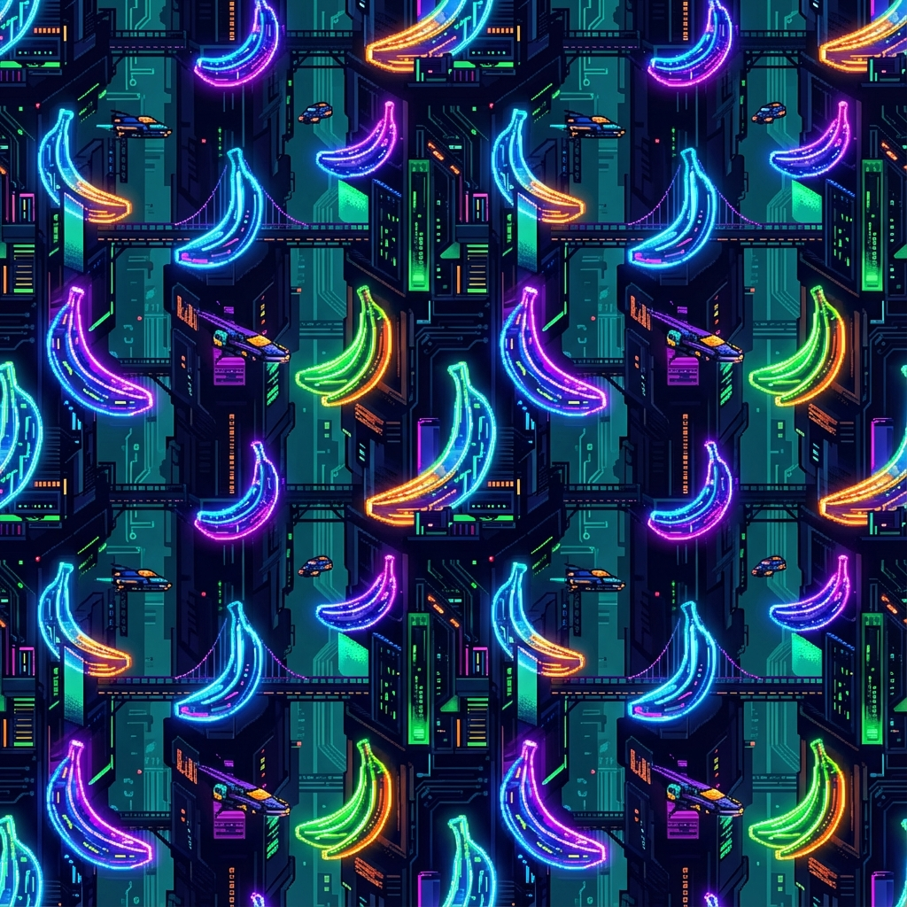

# 🐍 Serpentine - Advanced Snake Game

A modern, feature-rich snake game with stunning visuals, AI enemies, and unique Nano Banana themes!



## ✨ Features

### 🎨 **Nano Banana Themes**
- **Nano Cyber** - Futuristic cyberpunk city with neon glowing bananas
- **Nano Abstract** - Abstract nano-tech patterns with glowing circuits
- **Nano Jungle** - Alien jungle with bioluminescent banana plants
- Plus 7 additional stunning themes!

### 🎮 **Gameplay**
- **Massive Open World** - 4000x4000 game world with camera following
- **Smart AI Enemies** - 10 enemy snakes with advanced pathfinding
- **Power-Up System** - Speed boost, slow motion, ghost mode, score multiplier, and magnet
- **300+ Food Items** - Scattered across the world for endless gameplay
- **Realistic Physics** - Smooth snake movement with momentum

### 🎤 **AI Commentary**
- **Hyderabadi Taunt System** - Hilarious AI-generated voice commentary in authentic Hyderabadi slang
- Powered by Google Gemini AI and Text-to-Speech
- Pre-cached audio for instant playback

### ⚡ **Performance Optimized**
- Viewport culling - Only renders visible objects
- Batched rendering - Optimized draw calls
- AI throttling - Smart update scheduling
- Runs at 60 FPS even with hundreds of entities

## 🚀 Getting Started

### Prerequisites
- Modern web browser (Chrome, Firefox, Edge)
- Python 3 (for local server)

### Installation

1. Clone the repository:
```bash
git clone https://github.com/allrounder687/snake-game.git
cd snake-game
```

2. Start the local server:
```bash
# Windows
start-server.bat

# Mac/Linux
python3 -m http.server 8000
```

3. Open your browser to:
```
http://localhost:8000
```

## 🎮 How to Play

- **Arrow Keys** or **WASD** - Control snake direction
- **Space** - Pause game
- **M** - Mute/Unmute audio

### Game Modes
- **Speed Settings**: Slow, Normal, Fast, Insane
- **Snake Types**: Classic, Neon Glow, Cobra
- **Themes**: 10 unique visual themes

## 🛠️ Technology Stack

- **Vanilla JavaScript** - No frameworks, pure performance
- **HTML5 Canvas** - Hardware-accelerated rendering
- **Google Gemini AI** - Dynamic taunt generation
- **Web Speech API** - Text-to-speech synthesis
- **LocalStorage** - Save/load game state

## 📁 Project Structure

```
snake-game/
├── assets/              # Background images
├── css/                 # Stylesheets
├── js/
│   ├── classes/        # Game classes
│   │   ├── Game.js
│   │   ├── Snake.js
│   │   ├── EnemySnake.js
│   │   ├── Food.js
│   │   ├── PowerUp.js
│   │   ├── ThemeManager.js
│   │   ├── ParticleSystem.js
│   │   ├── AudioManager.js
│   │   └── GeminiService.js
│   ├── config.js       # Game configuration
│   └── main.js         # Entry point
├── index.html
└── start-server.bat
```

## 🎨 Customization

### Adding New Themes
Edit `js/config.js` and add to the `THEMES` array:

```javascript
{
    name: 'Your Theme',
    score: 0,
    bg: '#000000',
    bgImage: 'assets/your-image.png', // Optional
    primary: '#00ff00',
    secondary: '#ff00ff',
    grid: '#333333'
}
```

### Adjusting Difficulty
Modify `js/config.js`:
- `FOOD_COUNT` - Number of food items
- `MAX_ENEMIES` - Maximum enemy snakes
- `SPEED_OPTIONS` - Available speed settings

## 🏆 Credits

Created by **allrounder687**

Special thanks to:
- Google Gemini AI for dynamic commentary
- The open-source community

## 📄 License

MIT License - Feel free to use and modify!

## 🐛 Known Issues

- AI voice may have rate limits (uses free tier)
- Background images require modern browser support

## 🚧 Future Enhancements

- [ ] Multiplayer mode
- [ ] Leaderboard system
- [ ] More power-ups
- [ ] Mobile touch controls
- [ ] Additional AI personalities

---

**Enjoy the game! 🎮🐍**

Star ⭐ this repo if you like it!
